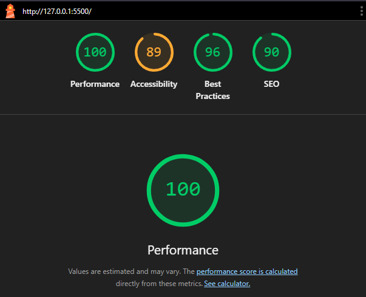
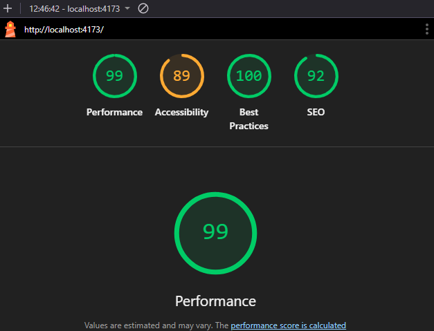

# HRnet – Conversion en Application React Moderne

## 📌 Présentation du projet

Ce projet consiste à convertir l’application interne **HRnet**, initialement développée en jQuery, en une version **moderne, performante et maintenable en React**.  
L’objectif était de remplacer progressivement les plugins jQuery existants par des **composants React maison** ou des librairies modernes, tout en améliorant la stabilité et la vitesse de l’application.

L’application permet :

- de **créer un employé**
- de **voir la liste des employés**
- de **stocker les données dans localStorage**
- d'utiliser des composants React modernes à la place des anciens plugins jQuery

---

## 🚀 Stack technique

- **React + Vite**
- **Redux Toolkit** pour la gestion de l’état global
- **React Router** pour la navigation
- **React DatePicker** (remplace le jQuery datepicker)
- **Composant Modal custom** (remplace jQuery.modal.js)
- **Librairie Table React** (remplace DataTables jQuery)
- **SCSS modulaire**
- Persistance via **localStorage**

---

## 🏗 Architecture principale

```
src/
 ├─ components/
 │   ├─ Modal/
 │   ├─ Dropdown/
 │   ├─ EmployeeTable/
 │   └─ Header/
 │
 ├─ pages/
 │   ├─ Home.jsx
 │   └─ EmployeeList.jsx
 │
 ├─ store/
 │   ├─ store.js
 │   └─ employeesSlice.js
 │
 ├─ styles/
 │   ├─ components/
 │   ├─ pages/
 │   └─ main.scss
 │
 ├─ App.jsx
 └─ main.jsx
```

---

## 🔄 Remplacement des plugins jQuery

| Plugin jQuery original | Solution React                                       |
| ---------------------- | ---------------------------------------------------- |
| jQuery Datepicker      | **React DatePicker**                                 |
| jQuery Modal           | **Modal React custom (fait maison)**                 |
| jQuery SelectMenu      | **Dropdown React custom**                            |
| DataTables             | **EmployeeTable React** (filter, pagination, search) |

Le composant Modal a été totalement réécrit et documenté dans un README dédié.

---

## 📦 Installation

```sh
npm install
npm run dev
```

Pour tester avec un build de production :

```sh
npm run build
npm run preview
```

---

## 🧪 Tests Lighthouse

Deux audits ont été réalisés :

### 📍 Version jQuery (ancienne)

- Mauvaise performance
- Scripts lourds
- Manipulation DOM inefficace
- Responsiveness limitée



### 📍 Version React (moderne)

- Temps de chargement grandement amélioré
- Score Lighthouse nettement plus haut
- DOM plus léger
- Composants découplés et modulaires



---

## 📚 Documentation complémentaire

Le README dédié à la migration complète se trouve ici :  
→ `README_HRNET_MIGRATION.md`

---

## 👤 Auteur

**Maxime FALCETTA** – Développeur Front-End  
Projet réalisé dans le cadre d’OpenClassrooms – Parcours Développeur Front-End